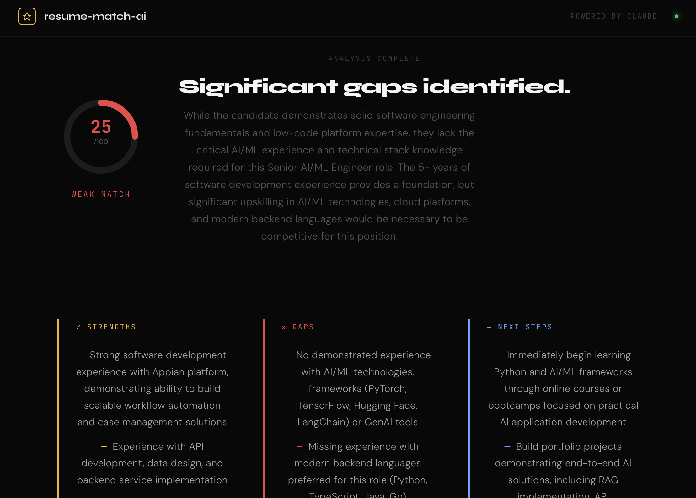

# resume-match-ai

An AI-powered resume analyzer that scores how well your resume matches a job description, identifies gaps, and gives actionable recommendations.

Built with FastAPI, React, and the Anthropic Claude API.



---

## What it does

Paste your resume and a job description. The app sends both to Claude and returns:

- **Match score** (0–100) with an animated ring gauge
- **Strengths** — what on your resume aligns with the role
- **Gaps** — what the job requires that your resume doesn't show
- **Next steps** — specific, prioritized recommendations to close the gap
- **Summary** — a plain-English verdict on your candidacy

---

## Tech stack

| Layer | Technology |
|---|---|
| Frontend | React 18, Vite |
| Backend | Python, FastAPI |
| AI | Anthropic Claude API (`claude-opus-4-20250514`) |
| Styling | Custom CSS-in-JS, Google Fonts (Syne, JetBrains Mono, DM Sans) |

---

## Project structure
```
resume-match-ai/
├── backend/
│   ├── app/
│   │   └── main.py        # FastAPI app, /analyze endpoint
│   └── requirements.txt
├── frontend/
│   └── src/
│       └── App.jsx        # React UI, score ring, results layout
├── .env                   # API key (not committed)
└── README.md
```

---

## Running locally

### Prerequisites
- Python 3.10+
- Node 18+
- An [Anthropic API key](https://console.anthropic.com)

### 1. Clone the repo
```bash
git clone https://github.com/kendrick-23/resume-match-ai.git
cd resume-match-ai
```

### 2. Start the backend
```bash
cd backend
python -m venv .venv
source .venv/bin/activate
pip install -r requirements.txt
```

Create a `.env` file in the project root:
```
ANTHROPIC_API_KEY=your_key_here
```

Then run:
```bash
uvicorn app.main:app --reload
```

Backend runs at `http://127.0.0.1:8000`

### 3. Start the frontend
```bash
cd frontend
npm install
npm run dev
```

Frontend runs at `http://localhost:5173`

---

## API

### `POST /analyze`

**Request body:**
```json
{
  "resume": "Your full resume text...",
  "job_description": "The job posting text..."
}
```

**Response:**
```json
{
  "result": "MATCH SCORE: 72\n\nSTRENGTHS:\n...\n\nGAPS:\n...\n\nRECOMMENDATIONS:\n...\n\nSUMMARY:\n..."
}
```

---

## Author

Christopher Kendrick — [github.com/kendrick-23](https://github.com/kendrick-23)